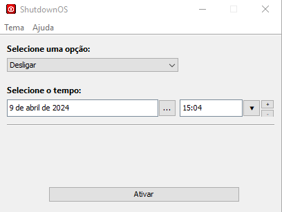

# ShutdownOS
O ShutdownOS é uma aplicação desktop com Java Swing com as funcionalidades de Desligar, Reiniciar e Hibernar. Está funcionando para os seguintes sistemas operacionais:

✅ Windows 11  
✅ Windows 10  
✅ Windows 8  
✅ Windows 7  
✅ Linux Ubuntu  
✅ Linux Mint  
❔  Linux Debian  
❔  MacOS

 

> [!NOTE]  
> `Versão MacOS em desenvolvimento`

 

<h3> Escolha o tema que preferir: </h3>

<h6> Windows </h6>

<h6> Nimbus </h6>

<h6> IntelliJ </h6>

<h6> Darcula </h6>

<h6> Flatlaf Light </h6>

<h6> Flatlaf Dark </h6>

<h6> Flatlaf Mac Light </h6>

<h6> Flatlaf Mac Dark </h6>

<h6> Metal </h6>
